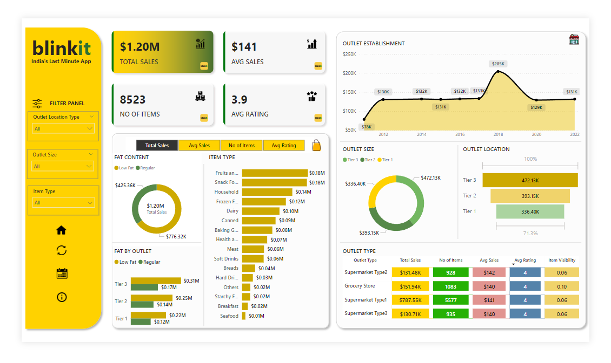

# 🛒 Blinkit Sales Analysis  
[]()  
[]()  
[]()  
[](https://github.com/Rohitdas-01/blinkit-sales-analysis-python-sql-powerbi)

---

## 📌 Table of Contents  
- [Overview](#overview)  
- [Business Requirement](#business-requirement)  
- [Dataset](#dataset)  
- [Tools & Technologies](#tools--technologies)  
- [Project Structure](#project-structure)  
- [Exploratory Data Analysis (EDA)](#eda)  
- [EDA Insights](#eda-insights)  
- [SQL Insights](#sql-insights)  
- [Dashboard](#dashboard)  
- [How to Run This Project](#how-to-run-this-project)  
- [Contact](#contact)

---

## <a id="overview"></a>🧾 Overview  
This project analyzes Blinkit sales data to understand sales performance, customer ratings, product distribution, and outlet behavior.  
The workflow includes:

1. **Python (Jupyter Notebook):** Data cleaning, transformations, and EDA  
2. **SQL Server:** Deeper structured analysis  
3. **Power BI:** Interactive dashboard for insights and KPI tracking  

The goal is to support better decision-making in sales strategy, product planning, and outlet performance.

---

## <a id="business-requirement"></a>🎯 Business Requirement  
The objective is to analyze Blinkit’s sales, ratings, outlet characteristics, and product attributes to meet the business requirements:

### **KPI Requirements**
- Total Sales  
- Average Sales  
- Number of Items Sold  
- Average Customer Rating  

### **Analysis Requirements**
1. Total Sales by Fat Content  
2. Total Sales by Item Type  
3. Fat Content by Outlet for Total Sales  
4. Total Sales by Outlet Establishment Year  

### **Chart Requirements**
5. Percentage of Sales by Outlet Size  
6. Sales by Outlet Location  
7. All Metrics by Outlet Type  

These requirements help evaluate trends, compare outlet performance, study product demand, and understand customer preferences.

---

## <a id="dataset"></a>📂 Dataset  
- **Total Rows:** **8,523**  
- **Total Columns:** **13**  
- **Missing Values:** Missing values found in *Item Weight*  
- **Key Columns:**  
  - Outlet Size, Outlet Type, Location Type  
  - Item Type, Item Fat Content, Item Visibility  
  - Item Weight, Item Outlet Sales  
  - Rating  

---

## <a id="tools--technologies"></a>🛠 Tools & Technologies  
| Tool | Usage |
|------|--------|
| 🐍 **Python** | Data cleaning, EDA, chart generation |
| 🧮 **SQL Server** | Analytical queries and pattern extraction |
| 📊 **Power BI** | Dashboard creation |
| 📓 **Jupyter Notebook** | EDA workflow |
| 🗂 **GitHub** | Version control |

---

## <a id="project-structure"></a>📁 Project Structure  
```
blinkit-sales-analysis-python-sql-powerbi/
│
├── README.md
├── Business Requirement.pdf
├── blinkit_sales_report.pdf
│
├── notebooks/
│ └── exploratory_data_analysis.ipynb
│
├── sql/
│ └── blinkit_analysis_queries.sql
│
├── images/
│ └── blinkit_dashboard.png
│
└── dashboard/
└── blinkit_dashboard.pbix
```

---

## <a id="eda"></a>📊 Exploratory Data Analysis (EDA)

### Performed in Python (Jupyter Notebook):
- Loaded dataset and reviewed structure  
- Checked data types, unique values, and summary statistics  
- Cleaned *Item Fat Content* values (`LF → Low Fat`, `Reg → Regular`)  
- Handled missing values in **Item Weight**  
- Renamed all columns to **snake_case** for consistency  
- Created basic sales and rating visualizations  
- Exported cleaned dataset for SQL analysis  

---

## <a id="eda-insights"></a>🧠 EDA Insights (Key Findings)

- **Total Sales:** **$1,201,681**  
- **Average Sales:** **$141**  
- **Number of Items Sold:** **8,523**  
- **Average Rating:** **3.9**

---

## 📊 Insights From EDA Visualizations  

Additional insights were derived from the charts created during the EDA phase. These visuals helped in understanding product performance, outlet distribution, and sales behavior across categories.

### 🥛 **1. Sales by Fat Content**
The pie chart shows how sales are distributed between Low Fat and Regular products.

- **Low Fat:** **65%** of total sales  
- **Regular:** **35%** of total sales  

This indicates that Low Fat products contribute nearly **twice as much** to total sales compared to Regular items.

---

### 🍽 **2. Top 5 Item Types by Total Sales**
From the bar chart, the top-performing product categories based on total sales are:

1. **Fruits & Vegetables — $178,124**  
2. **Snack Foods — $175,434**  
3. **Household — $135,977**  
4. **Frozen Foods — $118,559**  
5. **Dairy — $101,276**  

These categories make up a large portion of overall sales, with *Fruits & Vegetables* being the highest contributor.

---

### 🏬 **3. Sales by Outlet Size**
The outlet size distribution reveals the contribution of each outlet category to total sales:

- **Medium:** **42.3%**  
- **Small:** **37.0%**  
- **High:** **20.7%**  

Medium-sized outlets generate the highest share of sales, followed by small outlets, while high-sized outlets contribute the least.

---

### Additional Observations  
- Low Fat and Regular items show a clear difference in their sales share, with Low Fat products contributing a larger portion of total sales.  
- Item types vary widely in their demand, with a few categories generating much higher sales than others.  
- Medium and Small outlets contribute most of the total sales, while High-sized outlets account for a smaller share.  
- Sales distribution across outlet locations shows noticeable differences, with some locations generating more sales than others.  
- Outlets established in different years show variations in performance, with some newer outlets displaying steadier sales levels.  
- Ratings remain generally consistent across products, with only minor differences between categories. 

---

## <a id="sql-insights"></a>🧠 Insights From SQL Analysis  

The SQL analysis provided a deeper understanding of outlet performance, product behavior, and sales patterns across the business. The key insights are:

### 1. Underperforming Outlets Within the Same Location Tier  
By comparing outlets inside each location tier, we identified stores that generate much lower sales than other outlets in the same tier. This shows that the issue is not the location itself but differences in outlet performance.

---

### 2. Top 20% Items Driving Most of the Total Sales  
A small group of items contributes to a large portion of overall revenue. These high-performing items are critical for maintaining sales volume and need consistent availability and stock management.

---

### 3. High-Rated Items With Low Sales  
Several products have strong customer ratings but low sales numbers. These items show potential but may lack visibility or placement, which limits their overall performance.

---

### 4. Sales Efficiency of New vs Old Outlets  
Newer outlets and older outlets show differences in their ability to generate sales. This comparison helps highlight which outlets operate efficiently and which need support, based on how long they have been running.

---

### 5. Item Categories With High Sales Fluctuations  
Some product categories show large changes in sales over time. These unstable sales patterns make inventory planning difficult and require closer monitoring to prevent overstocking or stock shortages.

---

### 6. Sales Patterns Across Outlet Size, Type, and Establishment Year  
The analysis also highlighted how sales differ based on outlet size, outlet type, and the year the outlet was established. These differences help in understanding what kind of stores perform better and what factors may influence their sales levels.

---


## <a id="dashboard"></a>📈 Dashboard (Power BI)

The Power BI dashboard presents:

- Key metrics: Total Sales, Average Sales, Items Sold, Average Rating  
- Sales by Fat Content  
- Sales by Item Type  
- Sales by Outlet Size & Location  
- Year-wise Outlet Establishment performance  
- Metrics by Outlet Type  

### **Dashboard Image**  


---

## <a id="how-to-run-this-project"></a>▶️ How to Run This Project  

### Step 1 - Clone the Repository**
```bash
git clone https://github.com/Rohitdas-01/blinkit-sales-analysis-python-sql-powerbi.git
```
### Step 2 - Run Exploratory Data Analysis (Python)

Open Jupyter Notebook

Navigate to notebooks/
Run:
```bash
exploratory_data_analysis.ipynb
```
This includes:
- Data loading
- Data cleaning
- Feature preparation
- Basic visual summaries
- Exporting cleaned dataset for SQL
- 
### Step 3 - Load Data into SQL Server

1. Import the cleaned CSV
2. Execute SQL queries from:
```bash
sql/blinkit_analysis_queries.sql
```
### Step 4 - Open Power BI Dashboard
```bash
dashboard/blinkit_dashboard.pbix
```
Step 5 - Review Final Outputs
- blinkit_sales_report.pdf
- Power BI dashboard
- SQL insights

---

## <a id="contact"></a>📞 Contact


**Rohit Das**

** Email:**  
rohit.41.das@gmail.com  

** LinkedIn:**  
https://www.linkedin.com/in/rohit-das-jsr/


